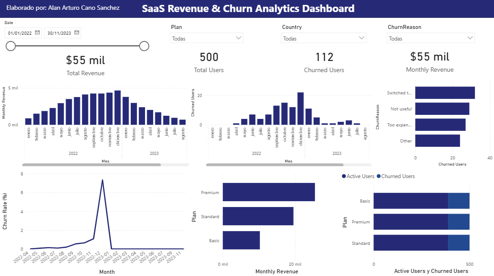

# 📊 SaaS Revenue Analytics

Proyecto de análisis de ingresos y cancelaciones en una empresa SaaS utilizando **PySpark**, **Python**, **Power BI** y un enfoque orientado a datos.

Incluye limpieza de datos, construcción de un modelo dimensional (esquema estrella), integración con PySpark y visualización futura con herramientas BI.

---

## 🎯 Objetivo

- Analizar los ingresos mensuales generados por usuarios.
- Identificar tasas de cancelación (churn) y razones más frecuentes.
- Detectar patrones por país, tipo de suscripción y duración del plan.
- Implementar un flujo ETL escalable con PySpark.
- Construir una **tabla de hechos** para análisis avanzado en Power BI.

---

## 🛠️ Tecnologías utilizadas

- **Python** (pandas, matplotlib)
- **PySpark** (procesamiento distribuido)
- **Power BI** (visualización futura)
- **Jupyter Notebooks**
- **Git & GitHub**

---

## 🧱 Modelo Dimensional

Se implementó un esquema tipo **estrella** compuesto por:

### 📌 Tabla de Hechos – `fact_revenue`

| Campo         | Descripción                          |
|---------------|--------------------------------------|
| UserID        | Usuario que realiza el pago          |
| PaymentDate   | Fecha del pago                       |
| Amount        | Monto pagado en USD                  |
| PaymentMethod | Método de pago                       |
| Month         | Mes del pago (YYYY-MM)               |

---

### 📂 Tablas de Dimensión

- `dim_user`: Información del país y registro del usuario.
- `dim_subscription`: Tipo de plan, duración y fecha de inicio.
- `dim_churn`: Fecha y motivo de cancelación.
- `dim_calendar`: Soporte para análisis temporal detallado.

---

## 📁 Estructura del proyecto

`````
saas-revenue-analytics/
│
├── data/ # Datos originales y limpios (CSV)
├── notebooks/ # Limpieza y análisis exploratorio
├── spark_jobs/ # Scripts PySpark para construir tabla de hechos
├── dashboards/ # Power BI 
├── README.md # Documentación principal del proyecto
├── requirements.txt # Librerías necesarias
└── .gitignore
`````
---

## ⚙️ Cómo reproducir el proyecto

1. Clona el repositorio
2. Crea y activa un entorno virtual
3. Instala dependencias: `pip install -r requirements.txt`
4. Ejecuta los notebooks para explorar y limpiar los datos (notebooks/exploracion_inicial.ipynb)
5. Ejecuta la construcción de la tabla de hechos con Spark (python spark_jobs/build_fact_table.py)
6. Carga el resultado en Power BI para análisis interactivo


## 📈 Dashboard

Dashboard interactivo construido con **Power BI**, orientado a brindar visibilidad clara sobre el comportamiento financiero y de cancelaciones en una empresa SaaS.

Incluye filtros dinámicos por fecha, país y plan de suscripción. Proporciona una visión general y detallada para stakeholders y equipos de producto, marketing y finanzas.

📍 Indicadores clave visualizados:
- Ingresos mensuales (Monthly Revenue)
- Usuarios activos vs cancelados
- Motivos de cancelación
- Tendencias de churn a lo largo del tiempo


## 🧠 Observaciones clave del análisis

- **Los ingresos mensuales** han mostrado una tendencia estable, con un ligero crecimiento en la segunda mitad del período analizado.
- **Los motivos más frecuentes de cancelación** son “Switched to competitor" y “Not useful”, lo cual indica posibles oportunidades para campañas de retención y engagement.
- **Pico de cancelaciones en diciembre de 2022**, lo que coincide con la tasa de churn más alta del periodo analizado.
- **El plan Premium genera la mayor parte del ingreso mensual**, seguido por el Standard y el Basic. Esto sugiere que usuarios con mayor disposición a pagar representan una fuente clave de ingresos.


### 🖼️ Vista general del dashboard




## 👤 Autor

- [Alan Arturo Cano Sanchez](https://www.linkedin.com/in/alan-arturo-cano-sanchez-511855361)  •[Portafolio](https://alancanoportafolio.netlify.app/) 

